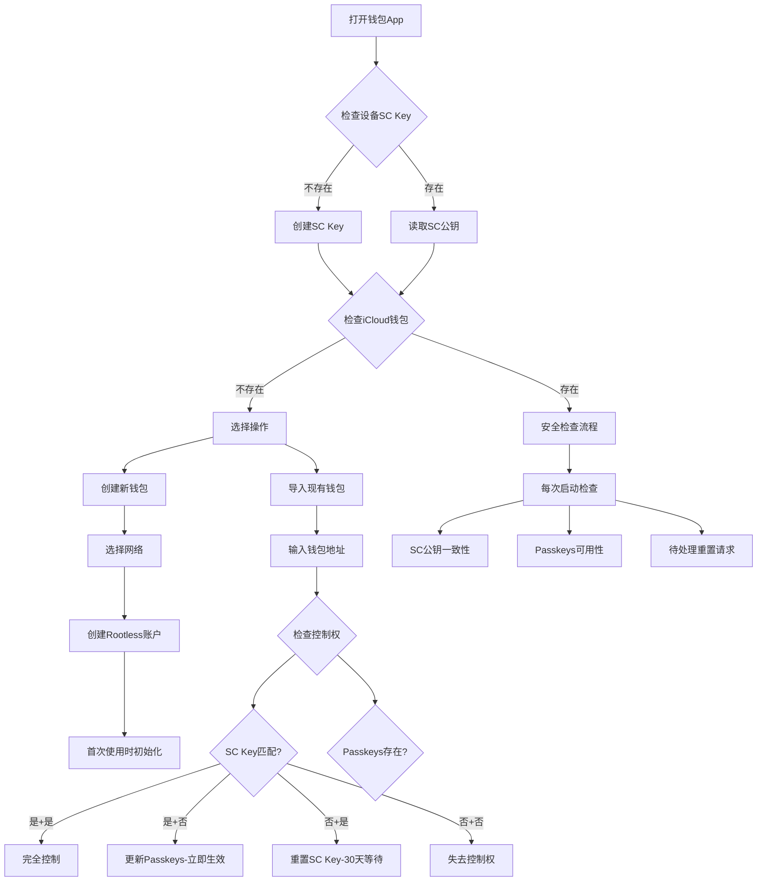

# 智能钱包初始化与安全检查流程

## 流程图



## 1. 初始化流程分析

### ✅ 优点
1. **完整的状态覆盖**：考虑了所有可能的密钥组合
2. **安全检查机制**：每次启动都验证密钥状态
3. **早期预警**：检测未授权的重置请求
4. **单一Passkeys策略**：所有钱包共用，简化管理

### 🔧 需要优化的地方

## 2. 优化建议

### 优化1：分层检查优先级
```swift
enum WalletInitState {
    case firstTime           // 全新用户
    case returning           // 老用户返回
    case deviceChanged       // 换设备
    case suspicious          // 检测到异常
}

func determineInitState() -> WalletInitState {
    // 1. 快速路径：一切正常
    if scKeyMatches() && passkeysValid() && !hasPendingRequests() {
        return .returning
    }
    
    // 2. 设备变更检测
    if !scKeyExists() && passkeysValid() {
        return .deviceChanged
    }
    
    // 3. 异常检测
    if hasPendingRequests() || passkeysDeleted() {
        return .suspicious
    }
    
    // 4. 新用户
    return .firstTime
}
```

### 优化2：静默检查 vs 主动提醒
```swift
struct SecurityCheck {
    enum Severity {
        case info       // 静默记录
        case warning    // 黄色提醒
        case critical   // 红色警告，需要立即处理
    }
    
    func performStartupChecks() {
        // 静默检查（不打扰用户）
        checkSCKeyConsistency()      // info
        verifyPasskeysHealth()        // info
        
        // 需要提醒的检查
        if let request = checkPendingResets() {
            if request.daysRemaining < 7 {
                showAlert(.critical, "紧急：重置请求将在\(request.daysRemaining)天后生效")
            } else {
                showAlert(.warning, "检测到重置请求")
            }
        }
    }
}
```

### 优化3：Passkeys健康检查
```swift
class PasskeysHealthMonitor {
    // 不要每次都完整登录，使用轻量级检查
    func quickHealthCheck() async -> Bool {
        // 方案1：检查Passkeys元数据
        let credentials = try? await ASAuthorizationPlatformPublicKeyCredentialProvider
            .relyingPartyIdentifier(rpID)
            .availableCredentials()
        
        return !credentials.isEmpty
    }
    
    // 定期深度检查（每周一次）
    func deepHealthCheck() async -> HealthReport {
        // 实际尝试签名一个测试消息
        let testChallenge = generateTestChallenge()
        let result = try? await signWithPasskey(testChallenge)
        
        return HealthReport(
            available: result != nil,
            lastChecked: Date(),
            nextCheckDue: Date().addingDays(7)
        )
    }
}
```

### 优化4：重置请求的智能检测
```swift
struct ResetRequestMonitor {
    // 推送通知而不是等待启动
    func enablePushNotifications() {
        // 当检测到重置请求时立即推送
        CloudKit.subscribe(to: .resetRequests) { request in
            sendPushNotification(
                title: "⚠️ 安全警告",
                body: "检测到账户恢复请求，如非本人操作请立即查看",
                urgency: .critical
            )
        }
    }
    
    // 智能判断是否为用户自己发起
    func analyzeResetRequest(_ request: ResetRequest) -> ThreatLevel {
        // 检查多个维度
        let factors = [
            request.initiatorDevice == currentDevice,      // 同设备
            request.initiatorLocation ~= userLocation,     // 相近位置
            request.timing.isNormalHours,                  // 正常时间
            recentUserActivity.contains(.deviceLost)       // 最近报告设备丢失
        ]
        
        let score = factors.filter { $0 }.count
        return score >= 3 ? .low : .high
    }
}
```

### 优化5：渐进式安全提升
```swift
enum SecurityLevel {
    case basic      // 单一Passkeys
    case enhanced   // 多Passkeys (2/3)
    case maximum    // Passkeys + 硬件密钥
}

func suggestSecurityUpgrade(basedOn wallet: Wallet) {
    let balance = wallet.totalValue
    
    if balance > 10_000 {
        suggest("您的资产超过1万美元，建议启用多重Passkeys保护")
    }
    
    if balance > 100_000 {
        suggest("高价值账户建议添加硬件密钥作为额外保护")
    }
}
```

### 优化6：紧急恢复通道
```swift
// 社交恢复作为最后防线
struct SocialRecovery {
    let guardians: [Guardian]
    let threshold: Int = 3  // 需要3/5监护人
    
    func initiateEmergencyRecovery() {
        // 当SC和Passkeys都丢失时的最后手段
        // 需要更长等待期（60天）
        // 需要监护人签名确认
    }
}
```

## 3. 完整优化后的流程

```swift
class WalletInitializationFlow {
    
    func initialize() async {
        // Phase 1: 设备密钥检查
        let scKey = await checkOrCreateSCKey()
        
        // Phase 2: 快速健康检查
        let quickCheck = await performQuickHealthCheck()
        
        if quickCheck.isHealthy {
            // 快速路径：一切正常
            await showMainWallet()
            
            // 后台执行深度检查
            Task {
                await performDeepHealthCheck()
            }
        } else {
            // 需要用户介入
            await handleAbnormalState(quickCheck)
        }
        
        // Phase 3: 注册监控
        await setupMonitoring()
    }
    
    private func performQuickHealthCheck() async -> HealthStatus {
        return HealthStatus(
            scKeyValid: await verifySCKey(),
            passkeysAvailable: await checkPasskeysQuick(),
            pendingResets: await checkPendingResets(),
            iCloudSynced: await checkiCloudSync()
        )
    }
    
    private func setupMonitoring() async {
        // 1. 推送通知
        await enablePushNotifications()
        
        // 2. 定期检查
        schedulePeriodicChecks()
        
        // 3. 异常检测
        enableAnomalyDetection()
    }
}
```

## 4. 安全检查清单

### 每次启动（必须）
- [x] SC Key 存在性
- [x] iCloud 钱包数据完整性
- [x] 待处理重置请求

### 每次启动（建议）
- [x] Passkeys 快速可用性检查
- [x] SC公钥一致性（可后台）

### 定期检查（每日）
- [ ] Passkeys 深度健康检查
- [ ] 异常活动分析

### 定期检查（每周）
- [ ] 完整的密钥轮换检查
- [ ] 安全等级评估

## 5. 用户体验优化

### 减少打扰
1. **分级提醒**：只有重要事项才打断用户
2. **批量检查**：合并多个检查，减少等待
3. **后台处理**：非关键检查放后台

### 提高安全意识
1. **安全仪表板**：可视化显示安全状态
2. **安全评分**：激励用户提升安全等级
3. **教育提示**：解释为什么需要这些检查

## 6. 特殊情况处理

### 场景1：用户主动换设备
```swift
func handleDeviceTransfer() {
    // 生成迁移码
    let migrationCode = generateMigrationCode()
    
    // 在新设备上输入迁移码
    // 可以跳过30天等待期
}
```

### 场景2：紧急冻结
```swift
func emergencyFreeze() {
    // 发现异常时立即冻结
    // 需要多重验证才能解冻
}
```

## 7. 最终建议

您的流程已经很完善，主要优化方向：

1. **性能优化**：分层检查，快速路径优先
2. **用户体验**：减少不必要的打扰
3. **主动防御**：推送通知而非被动检查
4. **容错机制**：添加社交恢复等备用方案
5. **智能分析**：基于行为模式判断威胁等级

核心原则：
> "安全检查应该像保镖一样 - 始终警惕但不打扰主人，只在真正有威胁时才出声警告。"

这样既保证了安全性，又不会影响日常使用体验。